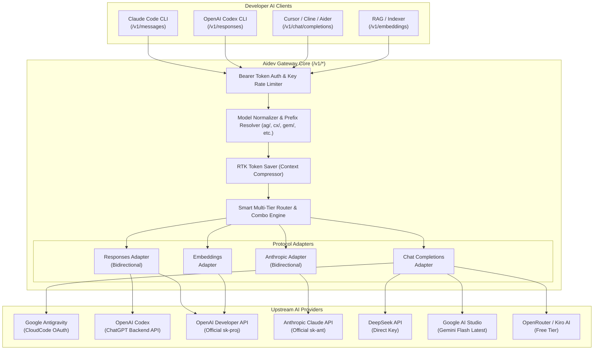

# PRODUCT REQUIREMENT DOCUMENT (PRD)
# 9Router Parity: Universal Multi-Protocol AI Routing & Token Optimization Engine

- **Project**: Aidev Gateway (`aidev-gateway`)
- **Document Version**: 1.0.0
- **Status**: Proposed / Ready for Review
- **Date**: 2026-09-17
- **Author**: Antigravity Technical Architecture Team
- **Benchmark Reference**: [9Router (decolua/9router)](https://github.com/decolua/9router)

---

## 1. Executive Summary & Objective

**Aidev Gateway** telah berhasil mengimplementasikan multi-provider dashboard, live request stream, serta adapter native untuk **Google Antigravity** dan **OpenAI Codex** (metode reverse-engineered ChatGPT backend).

Untuk mencapai kesetaraan penuh (*feature parity*) dan melampaui kemampuan **9Router**, sistem gateway ini perlu diekspansi dari sekadar gateway Chat Completions menjadi **Universal AI Coding Gateway** yang mendukung:
1. **Dukungan Multi-Protokol Lengkap (`/v1/*`)**:
   - `POST /v1/responses` (OpenAI Agentic Responses API generasi baru untuk Codex CLI & modern agent loops).
   - `POST /v1/messages` (Native Anthropic Claude API untuk **Claude Code CLI** & Cline).
   - `POST /v1/embeddings`, `/v1/audio/transcriptions`, `/v1/audio/speech`, dan `/v1/images/generations`.
   - `GET /v1/models` & `GET /v1/models/{model}` dengan metadata capabilities lengkap (*context window, tools, reasoning*).
2. **RTK Token Saver Engine (Kompresi Output Tool)**:
   - Mengompresi output `git diff`, terminal log, dan file tree sebelum dikirim ke upstream LLM untuk **menghemat 20–40% token input**.
3. **3-Tier Cascading Fallback & Model Combos**:
   - Eksekusi otomatis dari **Tier 1 (Subscription: Codex/Antigravity)** $\rightarrow$ **Tier 2 (Cheap API: DeepSeek/Gemini)** $\rightarrow$ **Tier 3 (Free: OpenRouter/Kiro)** saat terjadi limit 429 atau kuota habis.
4. **Multi-Account Quota Maximizer & Intelligent Load Balancing**:
   - Weighted Round-Robin, Fill-First (Exhaustion), dan Lowest-Latency distribution antar akun multi-koneksi.

---

## 2. Competitive Analysis: Aidev Gateway vs. 9Router

| Fitur / Kemampuan | 9Router (Benchmark) | Aidev Gateway (Saat Ini) | Target PRD Ini (Aidev v2.5) |
| :--- | :--- | :--- | :--- |
| **Chat Completions (`/v1/chat/completions`)** | ✅ Ya (Streaming SSE & JSON) | ✅ Ya (200 OK di semua provider) | ✅ Ya (Dipertahankan & dioptimasi) |
| **Responses API (`/v1/responses`)** | ✅ Ya (Codex & OpenAI) | ❌ Belum (Hanya internal Codex) | ✅ **Full Support (Native Codex + Cross-provider)** |
| **Anthropic Messages (`/v1/messages`)** | ✅ Ya (Claude Code support) | ❌ Belum | ✅ **Full Support (Native Anthropic + Cross-provider)** |
| **Embeddings (`/v1/embeddings`)** | ✅ Ya | ❌ Belum | ✅ **Full Support (OpenAI / Ollama / OpenRouter)** |
| **Audio & Vision APIs** | ✅ Whisper & TTS | ❌ Belum | ✅ **Support Whisper STT & TTS Passthrough** |
| **Model Discovery (`/v1/models/{id}`)** | ✅ Kaya metadata | ⚠️ Hanya daftar nama sederhana | ✅ **Metadata lengkap (Context, Reasoning, Tools)** |
| **Token Optimization (RTK Token Saver)** | ✅ 20–40% penghematan | ❌ Belum ada | ✅ **Smart Context Compression Engine** |
| **Multi-Provider Hub** | ✅ 40+ provider | ✅ 6 provider utama + Custom | ✅ **Dukungan Kiro AI, OpenCode Free, Copilot** |
| **Multi-Account Failover** | ✅ 3-Tier Fallback | ⚠️ Basic Fallback | ✅ **3-Tier Combo Cascading Matrix** |
| **Dashboard & Observability** | ✅ Port 20128 Local Web UI | ✅ `/admin/*` Next.js 15 UI | ✅ **Light Theme Streamlined Console** |

---

## 3. Detailed Technical Architecture



---

## 4. Feature Specifications

### 4.1 Feature 1: Universal Multi-Protocol Endpoint Support

#### 4.1.1 Endpoint 1: Agentic Responses API (`POST /v1/responses`)
* **Tujuan**: Mendukung ekosistem tool agentic modern (seperti Codex CLI, Cursor Composer agentic loop, dan SDK OpenAI terbaru).
* **Format Request Masuk**:
  ```json
  {
    "model": "cx/gpt-5.5",
    "stream": true,
    "store": false,
    "instructions": "You are an expert fullstack architect.",
    "input": [
      { "role": "user", "content": "Refactor auth middleware to use JWT" }
    ],
    "tools": []
  }
  ```
* **Routing Behavior**:
  * **Jika Target adalah OpenAI Codex (`cx/*`)**:
    * Langsung diteruskan (*native passthrough*) ke `https://chatgpt.com/backend-api/codex/responses` menggunakan header `originator: codex_cli_rs` dan `ChatGPT-Account-Id`.
    * Mengalirkan event SSE native (`response.output_text.delta`, `response.output_item.done`, `response.completed`).
  * **Jika Target adalah Provider Chat Completions (DeepSeek / Gemini / Antigravity)**:
    * Menerjemahkan `input` dan `instructions` $\longrightarrow$ `messages`.
    * Memanggil upstream `/chat/completions`.
    * Menerjemahkan response/stream kembali ke format Responses API (`response.output_text.delta`, `response.completed`).

#### 4.1.2 Endpoint 2: Native Anthropic Messages API (`POST /v1/messages`)
* **Tujuan**: Memungkinkan **Claude Code CLI** resmi langsung memakai Aidev Gateway dengan satu perintah setting:
  ```bash
  export ANTHROPIC_BASE_URL="http://localhost:3000"
  export ANTHROPIC_API_KEY="sk-int-..."
  claude
  ```
* **Format Request Masuk**:
  * Header: `x-api-key: sk-int-...`, `anthropic-version: 2023-06-01`
  * Body: `{ "model": "claude-3-7-sonnet-20250219", "messages": [...], "system": "...", "max_tokens": 4096 }`
* **Routing Behavior**:
  * Jika target akun terhubung ke Anthropic resmi $\rightarrow$ Diteruskan langsung ke `https://api.anthropic.com/v1/messages`.
  * Jika target dialihkan ke model lain (misal via Combo Fallback ke Gemini / DeepSeek) $\rightarrow$ Gateway mengonversi format Anthropic ke format target, lalu membungkus output streaming ke format Anthropic SSE (`content_block_delta`, `message_delta`, `message_stop`).

#### 4.1.3 Endpoint 3: Embeddings API (`POST /v1/embeddings`)
* **Tujuan**: Digunakan oleh Cursor codebase indexing, Cline code search, dan vector embedding tools.
* **Format Request**: `{ "model": "text-embedding-3-small", "input": ["text to embed"] }`.
* **Routing Behavior**:
  * Resolusi ke akun OpenAI atau provider open-source (Ollama / OpenRouter / Together).
  * Menghasilkan struktur standar `{ "object": "list", "data": [{ "embedding": [...], "index": 0 }] }`.

#### 4.1.4 Endpoint 4: Comprehensive Model Discovery (`GET /v1/models` & `GET /v1/models/{model}`)
* Meniru 9Router dengan memberikan metadata kapabilitas mendalam pada setiap model:
  ```json
  {
    "id": "cx/gpt-5.5",
    "object": "model",
    "owned_by": "openai_codex",
    "capabilities": {
      "vision": true,
      "reasoning": true,
      "tools": true,
      "contextWindow": 400000,
      "maxOutput": 128000
    }
  }
  ```

---

### 4.2 Feature 2: RTK Token Saver (Context Compressor)

Salah satu keunggulan terbesar 9Router adalah **RTK Token Saver**, yang memotong biaya dan memperpanjang batas context window.

#### 4.2.1 Modul Kompresi:
1. **Git Diff Compactor**:
   * Memotong header git yang berulang (`index a1b2c3..d4e5f6 100644`).
   * Menghapus baris whitespace berlebih pada patch.
   * Mengompresi patch file biner atau file lock (`package-lock.json`, `yarn.lock`) menjadi ringkasan 1 baris.
2. **Directory Tree Minifier**:
   * Memotong folder sampah (`node_modules`, `.git`, `.next`, `dist`, `vendor`, `.cache`).
   * Menyatukan direktori kosong yang bersarang (`src/app/api/admin/...`).
3. **Compiler & Terminal Log Sanitizer**:
   * Menghapus kode warna ANSI (`\u001b[31m`, dsb.).
   * Menghilangkan frame stacktrace internal runtime yang repetitif.

#### 4.2.2 Konfigurasi & Kontrol:
* Toggle global di Admin Settings: `RTK Token Saver: [Active / Disabled]`.
* Header override dari klien: `X-RTK-Token-Saver: true/false`.
* Metrik penghematan token dihitung dan ditampilkan di Live Request Stream:
  $$\text{Tokens Saved} = \text{Raw Prompt Tokens} - \text{Compressed Prompt Tokens}$$

---

### 4.3 Feature 3: 3-Tier Cascading Fallback & Combo Model

9Router mengelompokkan provider ke dalam piramida 3-Tier agar developer tidak pernah berhenti ngoding (*zero downtime*):

```
┌─────────────────────────────────────────────────────────────┐
│ Tier 1: Subscription Accounts (Unlimited / Flat Rate)       │
│ Contoh: OpenAI Codex (ChatGPT), Google Antigravity (Cloud) │
└──────────────────────────────┬──────────────────────────────┘
                               │ (jika 429 / cooldown)
                               ▼
┌─────────────────────────────────────────────────────────────┐
│ Tier 2: Low-Cost Metered APIs (High Quality & Cheap)        │
│ Contoh: DeepSeek V3, Google Gemini 2.5 Flash, Groq           │
└──────────────────────────────┬──────────────────────────────┘
                               │ (jika saldo habis / limit)
                               ▼
┌─────────────────────────────────────────────────────────────┐
│ Tier 3: Zero-Cost Free Tiers (Safety Net)                   │
│ Contoh: OpenRouter Free Models, OpenCode Free, Kiro AI      │
└─────────────────────────────────────────────────────────────┘
```

#### 4.3.1 Perilaku Failover Otomatis:
1. Client mengirim request ke virtual combo model: `combo/coding-fast` atau model utama `cx/gpt-5.5`.
2. Gateway mencoba akun Tier 1 (**Akun Aiden - Codex**).
3. Jika Tier 1 mengembalikan `HTTP 429` (Rate Limit) atau `HTTP 503`:
   - Akun Tier 1 diberi status temporary cooldown selama 60 detik.
   - Gateway **seketika mengalihkan request ke Tier 2** (contoh: `ag/gemini-2.5-flash` - Akun Denis atau `deepseek-chat`).
   - Client menerima respon tanpa putus; event failover dicatat di log dengan badge `⚡ Failover`.

---

### 4.4 Feature 4: Multi-Account Load Balancing Matrix

Mendukung banyak akun untuk satu provider (contoh: 3 akun ChatGPT Plus/Pro, 5 akun Google Cloud):

1. **Strategi Distribusi**:
   - **Weighted Round-Robin**: Membagi beban secara merata sesuai bobot (weight) masing-masing koneksi.
   - **Fill-First (Exhaustion Mode)**: Menghabiskan kuota akun utama sampai limit, baru berpindah ke akun cadangan.
   - **Smart Health Ping**: Secara berkala melakukan background sync/ping setiap 5 menit untuk memastikan koneksi siap pakai sebelum request tiba.
2. **Proactive Token Refresh**:
   - Memperbarui OAuth Access Token 10 menit sebelum `tokenExpiresAt` menggunakan deduplication lock agar tidak terjadi race condition antar request paralel.

---

## 5. Database Schema Migration Plan

Untuk mendukung endpoint baru, RTK token saver, dan metadata 9Router, skema Prisma akan diperluas secara non-breaking:

```prisma
// Penambahan pada model UpstreamLog
model UpstreamLog {
  // ... field existing
  protocol          String   @default("OPENAI_CHAT") // "OPENAI_CHAT", "OPENAI_RESPONSES", "ANTHROPIC_MESSAGES", "EMBEDDINGS"
  tokensSavedRtk    Int      @default(0)             // Token yang berhasil dihemat oleh RTK
  compressionRatio  Float?                           // Rasio kompresi RTK (contoh: 0.72 = 28% hemat)
}

// Penambahan pada model SystemSetting / GlobalConfig
// - rtkCompressionActive: Boolean (default: true)
// - anthropicProtocolEnabled: Boolean (default: true)
// - responsesProtocolEnabled: Boolean (default: true)
```

---

## 6. Implementation Roadmap & Milestones

### **Fase 1: Protocol Expansion (Core 9Router Endpoints)**
- [ ] Implementasi router `POST /v1/responses` di `src/app/v1/[...path]/route.ts`.
- [ ] Implementasi router `POST /v1/messages` (Anthropic Messages protocol) beserta parser streaming event.
- [ ] Implementasi router `POST /v1/embeddings` ke OpenAI & OpenRouter.
- [ ] Update `GET /v1/models` agar menyertakan schema capabilities per model.

### **Fase 2: RTK Token Saver Engine**
- [ ] Buat utilitas kompresi konteks `src/lib/rtk/compressor.ts`.
- [ ] Filter khusus untuk patch `git diff`, directory trees, dan stack trace logs.
- [ ] Tambahkan kalkulasi `tokensSavedRtk` pada logging stream dashboard.

### **Fase 3: 3-Tier Fallback Matrix & Free Providers**
- [ ] Konfigurasi provider free-tier siap pakai (Kiro AI, OpenCode Free, OpenRouter Free).
- [ ] Penyempurnaan combo selector di `/admin/combos` dengan visualisasi Tier 1 $\rightarrow$ Tier 2 $\rightarrow$ Tier 3.

### **Fase 4: Testing & Client Verification**
- [ ] Test integrasi dengan **Claude Code CLI** asli via `/v1/messages`.
- [ ] Test integrasi dengan **Codex CLI** asli via `/v1/responses`.
- [ ] Test integrasi dengan **Cursor & Cline** via `/v1/chat/completions`.
- [ ] Benchmark perbandingan latensi dan penghematan token RTK.

---

## 7. Success Metrics (KPIs)

1. **Client Compatibility**: 100% kompatibel dengan Claude Code CLI, Codex CLI, Cursor, Cline, dan Aider tanpa error protokol.
2. **Zero Downtime**: Uptime 99.9% melalui cascading failover otomatis saat akun subscription terkena 429.
3. **Token Efficiency**: Penghematan token rata-rata 25% pada sesi koding intensif menggunakan RTK Token Saver.
4. **Latency Overhead**: Overhead gateway di bawah 20ms untuk request passthrough dan di bawah 50ms untuk kompresi RTK.
