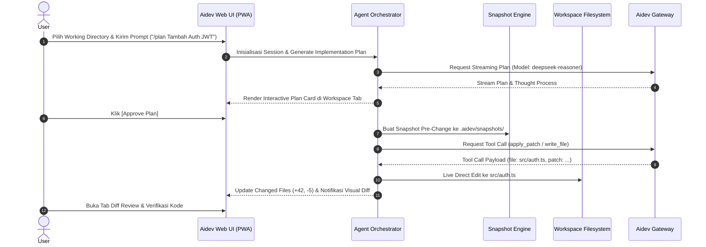
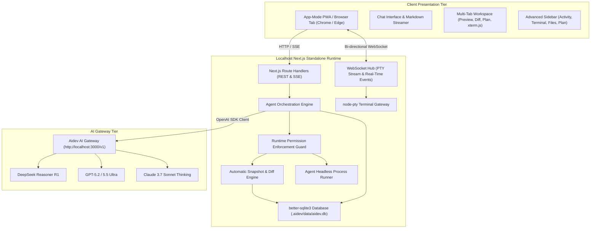
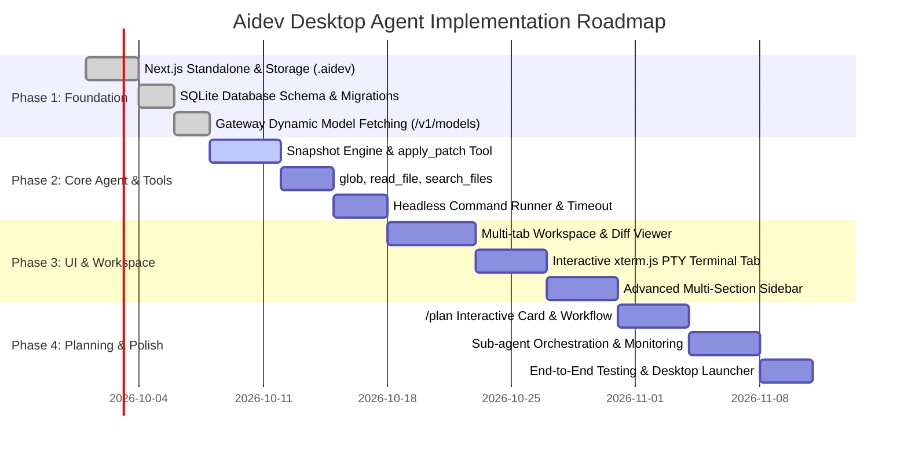

# Product Requirements Document (PRD) — Aidev Desktop Coding Agent

* **Project Name:** Aidev Desktop Coding Agent  
* **Version:** 1.0.0 (Production-Ready Spec)  
* **Target Platforms:** Windows 10/11, macOS, Linux  
* **Architecture:** Local Web Server (Next.js Standalone Node.js) + Browser / Standalone PWA Window  
* **Storage Root:** `$USERPROFILE/.aidev/` (Windows) / `~/.aidev/` (POSIX)  
* **Database Engine:** Embedded SQLite (`.aidev/data/aidev.db`) + File-based Snapshots & Artifacts  
* **Gateway Target:** `http://localhost:3000/v1` (Aidev AI Gateway / OpenAI-Compatible)  
* **Document Status:** Approved Architecture & Implementation Spec  

---

## 1. Executive Summary & Product Overview

### 1.1 Vision & Value Proposition
**Aidev Desktop Coding Agent** adalah autonomous coding agent desktop yang ringan, transparan, dan berkinerja tinggi. Berbeda dengan aplikasi berbasis Electron yang memakan memori hingga ratusan Megabyte (Chromium overhead), Aidev dibangun menggunakan arsitektur **Localhost Standalone Web Server (Node.js runtime)** yang diakses melalui browser modern atau jendela PWA mandiri (*App-Mode*). 

Aidev dirancang khusus untuk bekerja berdampingan dengan developer dalam lingkungan workspace nyata: memodifikasi kode melalui *Live Direct Edit* dengan *Automatic Snapshots*, menjalankan terminal PTY terisolasi, merencanakan fitur melalui sistem `/plan`, serta menyajikan visibilitas penuh terhadap tindakan agent melalui multi-tab workspace dan interactive permission cards.

### 1.2 Core Goals
1. **Ultra-Lightweight Resource Footprint:** Konsumsi RAM server idle < 40 MB, ukuran disk minimal, startup instan (< 1 detik).
2. **Transparent Agent Operations:** Setiap tool call (`apply_patch`, `read_file`, `write_file`, `run_command`, `glob`) memiliki status, timeline, dan output terstruktur yang dapat diaudit.
3. **Safe Direct Code Editing:** Kode ditulis langsung ke workspace agar dev server live reload berjalan instan, namun dilindungi oleh immutable snapshot otomatis sebelum penulisan file untuk pembatalan 1-klik (*Instant Revert*).
4. **Dual Terminal Architecture:** Pemisahan total antara *Headless Command Runner* milik agent (output terstruktur tanpa ANSI pollution) dan *Interactive PTY xterm.js* milik user.
5. **Gateway & Model Agnostic:** Integrasi dinamis dengan Aidev Gateway (`http://localhost:3000/v1`), mendukung DeepSeek Reasoner (dengan accordion thinking), GPT-5.2, Claude 3.7 Sonnet, dan Gemini.

### 1.3 Non-Goals
1. **Bukan Pengganti Text Editor / IDE Utama:** Aidev tidak bertujuan menggantikan VS Code, Cursor, atau JetBrains sebagai editor mengetik harian, melainkan bertindak sebagai agen pair-programming otonom di samping IDE.
2. **Bukan Cloud-Hosted Multi-Tenant SaaS:** Seluruh eksekusi filesystem, terminal, dan database berjalan 100% lokal di mesin pengguna tanpa mengirim file proyek ke server pihak ketiga selain prompt ke AI Gateway.

---

## 2. User Personas & Core User Journeys

### 2.1 User Personas
* **Persona A: Alex (Senior Full-Stack Engineer)**
  * *Kebutuhan:* Membutuhkan agent yang bisa merancang plan arsitektur modular, menulis patch bersih tanpa merusak struktur file lain, dan menjalankan unit test otomatis di terminal.
  * *Pain Point:* Benci agent yang lambat, rakus RAM, atau diam-diam memodifikasi file tanpa catatan perubahan yang jelas.
* **Persona B: Budi (Solo Developer & Rapid Prototyper)**
  * *Kebutuhan:* Membuat fitur baru dari awal dengan prompt deskriptif, memanfaatkan model pemikir (DeepSeek Reasoner R1 / o1) dengan token headroom besar.
  * *Pain Point:* Susah membatalkan perubahan kode jika hasil generate AI salah atau merusak syntax.

### 2.2 Core User Journeys



---

## 3. System Architecture & Component Design

### 3.1 High-Level Architecture Diagram



### 3.2 Packaging & Launching Model
* **Engine:** Next.js Standalone build (Node.js engine internal).
* **Launcher Scripts:**
  * Windows: `aidev-desktop.bat` (menjalankan server dan meluncurkan Chrome dalam mode app: `start chrome --app=http://localhost:3001`).
  * Linux/macOS: `aidev-desktop.sh` (`google-chrome --app=http://localhost:3001` atau default browser).
* **Port Management:** Default port `3001` (dengan fallback otomatis ke port `3002..3010` jika port terpakai).

---

## 4. Runtime & Storage Specification (`$USERPROFILE/.aidev/`)

### 4.1 Directory Structure Layout
Seluruh data, cache, session, dan konfigurasi lokal tersimpan rapi dan terisolasi dari source code proyek:

```text
$USERPROFILE/.aidev/ (Windows) / ~/.aidev/ (Linux & macOS)
├── config/
│   ├── settings.json              # Gateway URL, Default Model, Theme, Permissions Policy
│   └── keybindings.json           # Shortcuts & command palette keys
├── data/
│   └── aidev.db                   # SQLite database (sessions, messages, projects, audit)
├── projects/
│   ├── index.json                 # Metadata daftar project yang pernah dibuka
│   └── <project-id>/              # Workspace project default jika user tidak memilih folder
├── snapshots/
│   └── <session-id>/
│       ├── <snapshot-id>/
│       │   ├── manifest.json      # Metadata file yang dimodifikasi, timestamp, parent snapshot
│       │   └── backup/            # Copy konten file sebelum penulisan patch
├── artifacts/
│   └── <session-id>/              # Output dokumen, SVG, walkthrough, dan file hasil generate
├── logs/
│   ├── agent.log                  # Log aktivitas orchestrator & gateway
│   └── commands.log               # Log eksekusi perintah terminal headless
└── cache/
    └── models.json                # Cache hasil query GET /v1/models (TTL 10 menit)
```

### 4.2 SQLite Database Schema (`aidev.db`)

```sql
-- Projects Table
CREATE TABLE IF NOT EXISTS projects (
    id TEXT PRIMARY KEY,
    name TEXT NOT NULL,
    workdir_path TEXT NOT NULL UNIQUE,
    created_at INTEGER NOT NULL,
    last_opened_at INTEGER NOT NULL
);

-- Chat Sessions Table
CREATE TABLE IF NOT EXISTS sessions (
    id TEXT PRIMARY KEY,
    project_id TEXT NOT NULL,
    title TEXT NOT NULL,
    model_id TEXT NOT NULL,
    permission_mode TEXT NOT NULL DEFAULT 'ASK', -- 'ASK', 'AUTO', 'FULL_ACCESS'
    created_at INTEGER NOT NULL,
    updated_at INTEGER NOT NULL,
    FOREIGN KEY(project_id) REFERENCES projects(id) ON DELETE CASCADE
);

-- Messages & Tool Invocations
CREATE TABLE IF NOT EXISTS messages (
    id TEXT PRIMARY KEY,
    session_id TEXT NOT NULL,
    role TEXT NOT NULL,                         -- 'system', 'user', 'assistant', 'tool'
    content TEXT,
    reasoning_content TEXT,                    -- Thinking text dari DeepSeek R1 / o1
    tool_call_id TEXT,
    tool_name TEXT,
    tool_arguments TEXT,                       -- JSON stringified
    tool_result TEXT,                          -- JSON output / string
    status TEXT DEFAULT 'COMPLETED',           -- 'PENDING', 'RUNNING', 'COMPLETED', 'FAILED'
    created_at INTEGER NOT NULL,
    FOREIGN KEY(session_id) REFERENCES sessions(id) ON DELETE CASCADE
);

-- Immutable Snapshots for Instant Revert
CREATE TABLE IF NOT EXISTS snapshots (
    id TEXT PRIMARY KEY,
    session_id TEXT NOT NULL,
    message_id TEXT NOT NULL,
    file_path TEXT NOT NULL,
    diff_stat_additions INTEGER NOT NULL DEFAULT 0,
    diff_stat_deletions INTEGER NOT NULL DEFAULT 0,
    backup_file_path TEXT NOT NULL,
    status TEXT NOT NULL DEFAULT 'ACTIVE',     -- 'ACTIVE', 'REVERTED'
    created_at INTEGER NOT NULL,
    FOREIGN KEY(session_id) REFERENCES sessions(id) ON DELETE CASCADE
);

-- Sub-Agents Tracking
CREATE TABLE IF NOT EXISTS subagents (
    id TEXT PRIMARY KEY,
    parent_session_id TEXT NOT NULL,
    role_name TEXT NOT NULL,                   -- 'researcher', 'coder', 'tester'
    task_description TEXT NOT NULL,
    status TEXT NOT NULL DEFAULT 'RUNNING',    -- 'PENDING', 'RUNNING', 'COMPLETED', 'FAILED'
    started_at INTEGER NOT NULL,
    completed_at INTEGER,
    FOREIGN KEY(parent_session_id) REFERENCES sessions(id) ON DELETE CASCADE
);

-- Audit Trail
CREATE TABLE IF NOT EXISTS permission_audit (
    id TEXT PRIMARY KEY,
    session_id TEXT NOT NULL,
    action_type TEXT NOT NULL,                 -- 'COMMAND', 'FILE_WRITE', 'WEB_ACCESS'
    target_resource TEXT NOT NULL,
    decision TEXT NOT NULL,                    -- 'APPROVED', 'REJECTED', 'AUTO_ALLOWED'
    created_at INTEGER NOT NULL
);
```

### 4.3 Path Security & Sanitization
* **Path Traversal Guard:** Semua path file dinormalisasi menggunakan `path.resolve(workdir, requestedPath)`. Jika hasil resolving tidak diawali oleh `workdir`, operasi segera dihentikan dengan pesan `AccessDenied: Path traversal attempt detected`.
* **Symlink Traversal Check:** Menggunakan `fs.realpathSync` untuk memastikan target symlink tidak mengarah ke luar batas `workdir` tanpa izin eksplisit.

---

## 5. Agent Activity, Planning & Tool Specifications

### 5.1 Tool System Lifecycle

```
[Agent Emits Tool Call]
          │
          ▼
   [State: PENDING] ──► [Periksa Permission Policy: ASK / AUTO / FULL]
                                  │
                  ┌───────────────┴───────────────┐
                  ▼                               ▼
            Mode 'ASK'                 Mode 'AUTO' / 'FULL_ACCESS'
       [Render Confirm Card]                      │
       User Klik [Approve]                        ▼
                  │                        [State: RUNNING]
                  ├───────────────────────────────┤
                  ▼                               ▼
       [File Tool: apply_patch]         [Command: run_command]
       1. Backup ke .aidev/snapshots/   1. Spawn headless child_process
       2. Tulis patch ke workspace disk 2. Monitor timeout (default 60s)
       3. Hitung additions/deletions    3. Tangkap stdout, stderr, exit code
                  │                               │
                  └───────────────┬───────────────┘
                                  ▼
                         [State: COMPLETED]
                                  │
                                  ▼
         [Kirim Output Tool ke LLM via Messages Array]
```

### 5.2 Tool Specifications

#### 1. `apply_patch`
* **Deskripsi:** Menerapkan unified diff patch langsung ke file di workspace.
* **Input Parameters:**
  ```json
  {
    "path": "src/services/auth.ts",
    "patchText": "@@ -14,4 +14,9 @@\n+ import jwt from 'jsonwebtoken';\n..."
  }
  ```
* **Mekanisme Eksekusi:**
  1. Jalankan snapshot backup konten asli ke `$USERPROFILE/.aidev/snapshots/<session-id>/<id>/backup`.
  2. Parse hunks menggunakan library `diff` dengan toleransi fuzzy context line.
  3. Tulis konten baru ke disk menggunakan `fs.promises.writeFile`.
  4. Emit event `FILE_CHANGED` ke UI (path, additions: +5, deletions: -0).
* **Output Format:**
  ```json
  {
    "success": true,
    "path": "src/services/auth.ts",
    "additions": 5,
    "deletions": 0,
    "snapshotId": "snap_98a7bc"
  }
  ```

#### 2. `read_file`
* **Deskripsi:** Membaca isi file dengan pembatasan ukuran dan dukungan baris slice (`start_line`, `end_line`).
* **Input Parameters:**
  ```json
  {
    "path": "package.json",
    "start_line": 1,
    "end_line": 100
  }
  ```
* **Constraint:** Maksimal 500 KB per panggilan. File biner otomatis ditandai sebagai `[Binary File]`.

#### 3. `write_file`
* **Deskripsi:** Membuat file baru atau menulis ulang file secara utuh.
* **Input Parameters:**
  ```json
  {
    "path": "src/types/user.ts",
    "content": "export interface User { id: string; email: string; }"
  }
  ```

#### 4. `glob`
* **Deskripsi:** Menemukan file berdasarkan pola globbing cepat (misal `src/**/*.tsx`, `**/*.json`).
* **Input Parameters:**
  ```json
  {
    "pattern": "**/*.test.ts",
    "ignore": ["node_modules/**", ".git/**", "dist/**"]
  }
  ```
* **Engine:** Menggunakan `fast-glob` yang dioptimalkan untuk performa I/O tinggi.

#### 5. `search_files` (Grep)
* **Deskripsi:** Mencari teks atau regular expression di seluruh direktori project.
* **Output:** JSON list file, line number, dan cuplikan baris kode (dibatasi 100 kecocokan teratas).

#### 6. `run_command`
* **Deskripsi:** Menjalankan perintah shell secara headless di direktori workspace dengan kontrol timeout dan proteksi buffer.
* **Input Parameters:**
  ```json
  {
    "command": "npm run test",
    "timeoutMs": 60000
  }
  ```
* **Output Format:**
  ```json
  {
    "command": "npm run test",
    "exitCode": 0,
    "durationMs": 3412,
    "stdout": "PASS src/auth.test.ts\nTests: 4 passed, 4 total",
    "stderr": ""
  }
  ```

### 5.3 Planning Workflow (`/plan`)
1. User mengetik `/plan <tujuan>` atau agent memutuskan perlu planning terlebih dahulu.
2. Agent menganalisis codebase menggunakan tool read-only (`glob`, `search_files`, `read_file`).
3. Agent menghasilkan struktur JSON Implementation Plan:
   * **Goal Description**
   * **Phase Breakdown** dengan checklist task spesifik.
   * **Dependencies & Target Files**.
4. UI merender **Interactive Plan Card** di workspace:
   * Tombol: `[Approve & Start Implementation]`, `[Edit Plan]`, `[Reject]`.
5. Progress setiap task (Pending -> In Progress -> Done) diperbarui secara real-time via WebSocket di sidebar tab **Implementation Plan**.

### 5.4 Sub-Agent Hierarchy Model
* **Orchestrator Agent:** Menangani chat utama, koordinasi plan, dan memutuskan pembagian tugas.
* **Sub-Agent Tipe 1: `researcher`** (Read-Only): Diberikan instruksi survei file, hanya dilengkapi tool `read_file`, `glob`, dan `search_files`. Konteks terisolasi sehingga tidak mengotori chat utama dengan log pencarian panjang.
* **Sub-Agent Tipe 2: `coder`** (Write-Focused): Diberikan instruksi implementasi spesifik pada file target, dilengkapi `apply_patch` dan `write_file`.
* **Sidebar Monitoring:** Tab **Sub-agents** menampilkan daftar sub-agent yang sedang berjalan, progress, dan tombol *Cancel* / *Inspect Transcript*.

---

## 6. Interactive UI/UX & Multi-Tab Workspace

### 6.1 Layout Wireframe

```text
┌────────────────────────────────────────────────────────────────────────────────────────────────────────────────────────┐
│ Top Bar: Aidev Agent   [Project: my-saas-app ▼]   [Model: deepseek-reasoner ▼]   [Tokens: 5.4M / 30 RPM]   [⚙ Settings] │
├─────────────────────────┬────────────────────────────────────────────────────────┬─────────────────────────────────────┤
│ SIDEBAR (Multi-Section) │ MAIN CHAT WORKSPACE                                    │ MULTI-TAB WORKSPACE                 │
│ ─────────────────────── │ ────────────────────────────────────────────────────── │ ─────────────────────────────────── │
│ [Tabs / Dropdown]:      │ User: Buatkan authentication middleware JWT di Express │ [Tab: auth.ts (Diff)] [Tab: PTY 1] │
│ • Activity (3 running)  │                                                        │ ─────────────────────────────────── │
│ • Implementation Plan   │ Agent:                                                 │ [Unified Diff] [Split Diff] [Revert]│
│ • Changed Files (4)     │ ┌────────────────────────────────────────────────────┐ │ @@ -10,3 +10,12 @@                  │
│ • Active Terminal (2)   │ │ 🧠 Thinking Process (DeepSeek R1)            ▼ │ │ - // TODO: Add auth middleware      │
│ • Sub-agents (1 idle)   │ ├────────────────────────────────────────────────────┤ │ + export const authMiddleware = ... │
│ • Media & Artifacts     │ │ Menganalisis express router dan konfigurasi JWT... │ +   const token = req.headers...    │
│ • Walkthrough           │ └────────────────────────────────────────────────────┘ │ +   jwt.verify(token, SECRET)...    │
│                         │                                                        │                                     │
│ [Changed Files List]:   │ ┌────────────────────────────────────────────────────┐ │ Line +12, -1 (Saved to disk)        │
│ 📄 auth.ts (+12, -1)    │ │ ⚡ Tool: apply_patch ("src/middleware/auth.ts")   │ │                                     │
│ 📄 package.json (+2)    │ │ Status: Completed (320ms) - Snapshot #04 Created  │ │ ─────────────────────────────────── │
│ 📄 index.ts (+4, -2)    │ └────────────────────────────────────────────────────┘ │ [Terminal Tab (xterm.js)]:          │
│                         │                                                        │ $ npm test                          │
│                         │ Saya telah menambahkan middleware JWT dan mendaftarkan │ PASS test/auth.test.ts              │
│                         │ dependensi jsonwebtoken ke package.json.               │ Tests: 6 passed                     │
│                         │                                                        │ $ █                                 │
│ ─────────────────────── │ ────────────────────────────────────────────────────── │                                     │
│ [Workdir: C:/dev/saas]  │ Input: [@ mention file] [/plan] [Attach Image] [Send]  │ Status: Node v24.2, PTY Active      │
└─────────────────────────┴────────────────────────────────────────────────────────┴─────────────────────────────────────┘
```

### 6.2 Advanced Sidebar Sections
1. **Activity:** Menampilkan live stream queue eksekusi tool, durasi, latency TTFT, dan status running/completed/failed.
2. **Implementation Plan:** Checklist task interaktif berbasis plan aktif, menampilkan task mana yang sedang dikerjakan agent.
3. **Changed Files:** Daftar seluruh file yang berubah dalam session ini. Mengklik salah satu file langsung membuka **Diff Viewer** di tab workspace kanan tanpa menutup chat.
4. **Active Terminal:** Daftar sesi terminal PTY user yang sedang terbuka dengan indikator proses aktif (misal `npm run dev` running).
5. **Sub-agents:** Visualisasi worker sub-agent yang sedang melakukan background research atau patching.
6. **Media History:** Thumbnail gambar diagram arsitektur atau mockup UI yang pernah di-attach oleh user.
7. **Artifacts & Walkthrough:** Ringkasan deliverable dan dokumen final yang digenerate oleh AI.

### 6.3 Multi-Tab Workspace Features
* **Closeable Tabs:** User dapat membuka banyak tab (File Preview, Unified Diff, Split Diff, Interactive Terminal, Artifacts).
* **Split Diff View:** Menampilkan kode sebelum vs sesudah bersebelahan (*side-by-side*) dengan warna hijau (+ additions) dan merah (- deletions).
* **1-Click Revert Button:** Mengembalikan isi file ke state snapshot sebelumnya secara instan jika perubahan AI tidak diinginkan.
* **Interactive Terminal Tab (`xterm.js`):** Terminal penuh yang mendukung input keyboard, mouse scroll, copy/paste, tab autocomplete, dan warna ANSI 256.

### 6.4 Interactive Permission & Confirmation Cards
Saat agent menjalankan aksi berisiko atau mode **Ask** aktif:
* **Komponen Kartu UI:**
  * Ikon jenis aksi (Kuning = Command Execution, Biru = File Write, Merah = File Deletion).
  * Path file / baris perintah terminal yang akan dijalankan.
  * Ringkasan dampak dan dependensi.
  * Tombol aksi:
    * `[✓ Approve Once]` — izinkan aksi ini saja.
    * `[✓ Always Allow for this Session]` — naikkan policy ke Auto untuk tipe aksi serupa.
    * `[✕ Reject]` — batalkan aksi dan berikan feedback error ke AI untuk mencari alternatif lain.

---

## 7. Security, Sandbox & Permission Enforcement

### 7.1 Permission Modes Specification
1. **Mode ASK (Default):**
   * Setiap penulisan file (`apply_patch`, `write_file`) dan eksekusi command shell (`run_command`) wajib meminta konfirmasi interaktif dari user melalui kartu UI.
   * Operasi read-only (`read_file`, `glob`, `search_files`) diizinkan otomatis jika berada di dalam `workdir`.
2. **Mode AUTO / TRUSTED:**
   * Operasi file di dalam `workdir` langsung ditulis otomatis (dengan backup snapshot).
   * Command shell standar yang aman (`npm test`, `git status`, `ls`, `cargo build`) diizinkan otomatis.
   * Perintah berbahaya (`rm -rf`, `format`, `del /s`, `drop table`, edit file di luar workdir) tetap memicu dialog konfirmasi.
3. **Mode FULL ACCESS:**
   * Agent memiliki izin penuh tanpa dialog konfirmasi untuk seluruh operasi di dalam `workdir`.
   * Khusus operasi di luar `workdir` atau perintah destruktif sistem tetap diblokir demi keamanan integritas OS host.

### 7.2 Command Sanitization & Blacklist
Runtime memfilter command yang berpotensi merusak sistem operasi sebelum diteruskan ke shell:
* **Blokir Mutlak:** `rmdir /s /q C:\`, `del /f /s /q C:\Windows`, `mkfs`, `dd if=`, fork bombs (`:(){ :|:& };:`).
* **Network Isolation:** Tool `run_command` tidak boleh membuka reverse shell atau mengunduh script executable asing tanpa konfirmasi.

---

## 8. Implementation Phases & Tech Stack Deliverables

### 8.1 Tech Stack Dependencies

```json
{
  "dependencies": {
    "next": "16.3.4",
    "react": "^19.0.0",
    "react-dom": "^19.0.0",
    "typescript": "^5.7.0",
    "tailwindcss": "^3.4.1",
    "lucide-react": "^0.475.0",
    "openai": "^4.85.0",
    "better-sqlite3": "^11.8.0",
    "fast-glob": "^3.3.3",
    "diff": "^7.0.0",
    "node-pty": "^1.0.2",
    "ws": "^8.18.0",
    "@xterm/xterm": "^5.5.0",
    "@xterm/addon-fit": "^0.10.0",
    "@xterm/addon-web-links": "^0.11.0",
    "prismjs": "^1.29.0",
    "react-markdown": "^9.0.3",
    "remark-gfm": "^4.0.0"
  },
  "devDependencies": {
    "@types/better-sqlite3": "^7.6.12",
    "@types/diff": "^7.0.0",
    "@types/ws": "^8.5.14"
  }
}
```

### 8.2 Phased Roadmap



---

## 9. Final Acceptance Criteria (Verification Matrix)

| ID | Fitur / Syarat | Kriteria Keberhasilan (Acceptance Criteria) |
| :--- | :--- | :--- |
| **AC-01** | **Workdir Picker** | User dapat memilih direktori kerja lokal sebelum chat. Jika dilewati, sistem menggunakan folder default `$USERPROFILE/.aidev/projects/<id>/`. |
| **AC-02** | **Dynamic Model Discovery** | Model picker di UI selalu sinkron dengan `GET /v1/models` dari Aidev Gateway secara otomatis. |
| **AC-03** | **Live Direct Edit** | Patch kode ditulis langsung ke workspace lokal dan langsung memicu live reload dev server tanpa delay. |
| **AC-04** | **Instant Snapshot & Revert** | Sebelum file ditulis, snapshot otomatis disimpan ke `.aidev/snapshots/`. Tombol **Revert** di diff tab mengembalikan file 100% identik ke versi sebelum patch. |
| **AC-05** | **Multi-Tab Workspace** | Tab file, diff, dan terminal dapat dibuka, ditutup, berpindah tanpa mengganggu atau memutus percakapan chat. |
| **AC-06** | **Dual Terminal Isolation** | Terminal agent (headless runner) tidak bercampur dengan sesi terminal interaktif user (`xterm.js` via `node-pty`). |
| **AC-07** | **Glob File Discovery** | Agent mampu mencari file berbasis pola globbing (`src/**/*.tsx`) dengan waktu respon < 100ms untuk 10.000 file. |
| **AC-08** | **Interactive /plan Workflow** | Perintah `/plan` memunculkan kartu plan interaktif dengan tombol Approve/Reject sebelum kode dieksekusi. |
| **AC-09** | **DeepSeek Reasoning Accordion** | Monolog pemikiran (reasoning) dirender di dalam accordion `Thought...` yang aman dan tidak hilang setelah streaming selesai. |
| **AC-10** | **Runtime Permission Enforcement** | Upaya akses file atau perintah di luar `workdir` otomatis dicegat di runtime backend, terlepas dari input frontend. |
| **AC-11** | **Crash Recovery** | Saat server dimatikan dan dinyalakan ulang, session, riwayat chat, snapshots, dan project context dapat di-hydrate kembali dari `aidev.db`. |

---
*Dokumen PRD ini telah divalidasi dan siap menjadi panduan implementasi teknis menyeluruh untuk tim engineering Aidev.*
